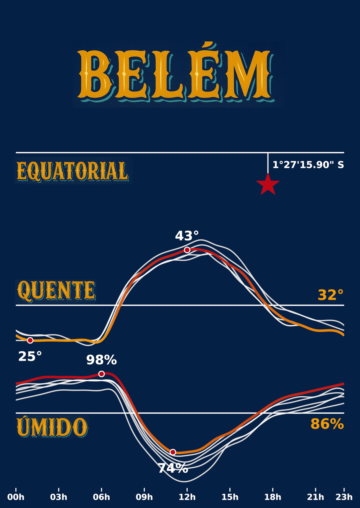

# Belém — Equatorial, Quente e Úmido



> Visualização climática de Belém (PA) com Python + INMET, celebrando o clima **EQUATORIAL**, **QUENTE** e **ÚMIDO**.  
> A imagem final é uma composição artística feita no GIMP com tipografia paraense.

## Sobre o projeto

Este projeto demonstra como usar **Python** para coletar e preparar dados do **INMET/BDMEP** e gerar visualizações sobre o clima de Belém.
Ele presta uma homenagem ao clima característico da cidade:

- **Equatorial** — A estrela no topo indica a latitude de Belém (~ **1°27'15.90" S**), dimensionada com base em um mapa do **IBGE** usado como referência na composição.
- **Quente** — Curva de **sensação térmica (feels like)** agregada a partir de dados dos **últimos 5 anos**. Destaques: **43 °C (máx)**, **25 °C (mín)** e **32 °C (média histórica)**.
- **Úmido** — Curva de umidade relativa com **98 % (máx)**, **74 % (mín)** e **86 % (média)**.

> **Observação**: As curvas mostram **sensação térmica (feels like)**, não a temperatura do ar convencional.

## Arquitetura de dados (Notebook)

O notebook segue um fluxo em **duas camadas principais** do padrão Medalhão:

- **Bronze**: ingestão bruta dos dados meteorológicos (BDMEP/INMET) via Databricks SQL (`read_files(...)`).
- **Silver**: limpeza, *casting*, padronização de datas/horas (fuso **America/Belem**), cálculo e organização das séries que alimentam os gráficos.

> Observação: o notebook inclui *magics* `%sql` (Databricks) e cria tabelas em `projetos.belem.*`.  
> Ajuste o **catálogo/esquema** e os **caminhos** conforme o seu ambiente (por exemplo, caminho do arquivo CSV no `read_files(...)`).

## Dependências

- Python: `pandas`, `numpy`, `matplotlib`, `seaborn`
- Geoespacial / forma da arte: `geopandas`, `shapely`, `geobr`, `scipy`
- (Opcional) `jupyter` para executar localmente

Instalação rápida (ambiente local):
```bash
python -m venv .venv
source .venv/bin/activate  # Windows: .venv\Scripts\activate
pip install -U pip
pip install pandas numpy matplotlib seaborn geopandas shapely geobr scipy jupyter
jupyter notebook "Equatorial _ Quente _ Umido.ipynb"
```

Em **Databricks**, adicione estes pacotes como **Libraries** do cluster (pypi) ou via `%pip install ...` conforme política do workspace.

## Estrutura do repositório

```
.
├── Equatorial _ Quente _ Umido.ipynb   # Notebook com todo o pipeline/visual (inclui cells %sql do Databricks)
├── Fonts/                              # Fontes usadas na composição (ver licenças específicas)
├── Referencias/                        # Estudos visuais, referências e rascunhos
└── Resultado/
    ├── imagem_final.png                # Peça final (composição no GIMP)
    ├── imagem_original_python.png      # Export direto do Python (antes do GIMP) — ver nota abaixo
    └── projeto_gimp.xcf                # Arquivo .xcf do GIMP (camadas/fontes)
```

### Nota sobre o caminho de saída da imagem gerada no Python

No notebook, a variável `out_png` pode estar definida para um caminho similar a um **Volume** do Databricks (ex.: `/Volumes/projetos/belem/raw/belem_combo.png`).
Para manter tudo dentro do repositório, **recomenda-se** alterar para:

```python
out_png = "Resultado/imagem_original_python.png"
fig.savefig(out_png, dpi=300, bbox_inches="tight", pad_inches=0.02, transparent=True, facecolor="none")
```

## Como reproduzir

1. Baixe os dados do **INMET/BDMEP** para Belém (últimos 5 anos) em https://bdmep.inmet.gov.br/ (cadastro necessário).
2. Ajuste o caminho do CSV (camada Bronze) no notebook — a leitura usa `read_files(..., header => true, skipRows => 10, delimiter => ';')`.
3. Execute as células Bronze → Silver → Visual.
4. (Opcional) Abra `Resultado/projeto_gimp.xcf` no **GIMP** para aplicar as fontes de `Fonts/` e compor a arte final. Exporte `Resultado/imagem_final.png`.

## Licenças

- **Código**: [MIT](LICENSE) — permite uso e modificação para quaisquer fins.
- **Assets visuais (imagens, layouts, mockups)**: [CC BY 4.0](ASSETS-LICENSE.md) — permite **qualquer modificação** e uso, inclusive comercial, com **atribuição**.
- **Fontes**: licenças próprias do(s) autor(es). Veja `FONTS-LICENSES.md` e mantenha os arquivos de licença de cada fonte.

## Contribuindo

1. Abra uma *issue* descrevendo melhorias/bugs.
2. Para PRs, siga o estilo do notebook e descreva claramente a etapa alterada (Bronze/Silver/Visual).
3. Evite commitar dados brutos do INMET que estejam sob termos específicos de uso.

## Autor

Feito por **Arnold Souza** — projeto Belém Chuva.
